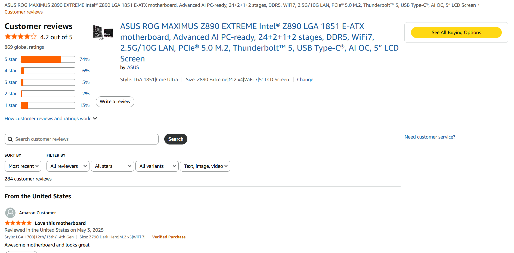
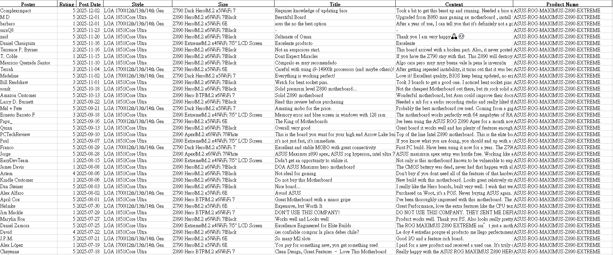

# Amazon-Comment-Crawler
An automated Amazon product review crawler developed with Python 3.13 + Playwright.
It automatically extracts product information, the latest reviews, ratings, etc,
then exports the collected data into an Excel file for easy analysis and organization.
 
*Before running the script, please update your AMAZON_EMAIL and AMAZON_PASSWORD in amazon_comment.py, and ensure your account has permission to view all product reviews.
 
## | **Features** 
 
1. Automatically opens each product page on Amazon 
2. Extracts product name 
3. Collects reviews sorted by **“Most recent”**, including: 
   · Reviewer name 
   · Rating (numeric only) 
   · Review date 
   · Style (if available) 
   · Size (if available) 
   · Review title 
   · Review content 
4. Automatically exports results to an **Excel (.xlsx)** file 
 
*Automatically stops at reviews older than one year to avoid duplicates and unnecessary data.* 
 
## | **Package Installation** 
 
`pip install -r requirements.txt` 
 
## | **Target Business Configuration** 
 
Please paste the Amazon products link of the business you want to scrape reviews from into **product_url**. 
 
## | **Output File** 
 
  
# | **Amazon 評論爬蟲** 
 
以 Python 3.13 + Playwright 開發的自動化 Amazon 評論爬蟲工具。 
可自動擷取產品資訊、最新評論、星等等資料， 
並將結果輸出為 Excel 檔案，方便後續分析與整理。 
 
*執行前請至 amazon_comment.py 更改您的 AMAZON_EMAIL & AMAZON_PASSWORD，確認您的帳號已被允許瀏覽商品所有評論
 
## | **功能特色** 
 
1. 自動開啟 Amazon 各產品頁面 
2. 擷取商品名稱 
3. 收集「最新排序」評論，包含： 
  · 評論者名稱 
  · 星等（純數字） 
  · 評論時間 
  · 產品規格 (若有) 
  · 產品尺寸 (若有) 
  · 評論標題 
  · 評論內容 
4. 結果自動輸出至 Excel (.xlsx) 
 
*自動停止在一年以前的評論，避免重複與冗長資料* 
 
## | **套件安裝** 
 
`pip install -r requirements.txt` 
 
## | **目標商家設定** 
 
請至 product_url 貼上想要爬取評論的產品連結
 
## | **輸出檔案** 
 
 
